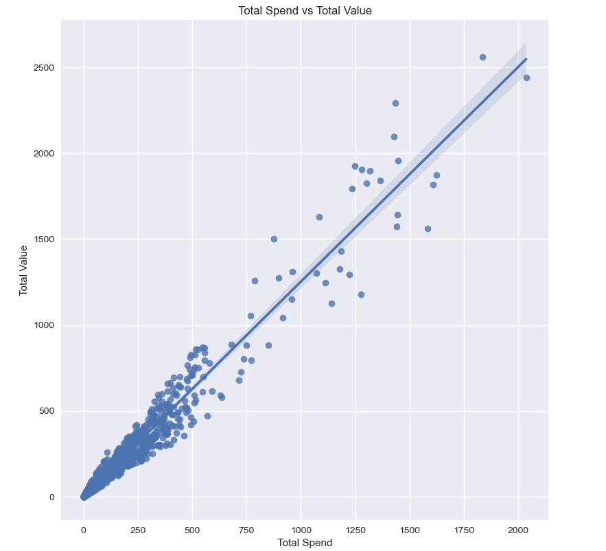

# Facebook Ads Data Analysis

## Project Overview
This project involves analyzing and visualizing the performance of Facebook advertising campaigns using the provided dataset `facebook_ads_data.csv`. The analysis focuses on metrics such as advertising spend and Return on Marketing Investment (ROMI), and it provides insights through various visualizations. The project is structured into several steps, detailed below.

## Dataset
- **File**: `facebook_ads_data.csv`
  

## Steps and Visualizations

### 1. Daily Grouping and Visualization

#### 1.1. Total Daily Advertising Spend (2021)
- **Description**: A line chart showing the total daily spend on Facebook ads for the year 2021.
- **Objective**: Visualize how advertising spend fluctuated day by day.
  
#### 1.2. Daily ROMI (2021)
- **Description**: A line chart showing the daily ROMI for Facebook ads in 2021.
- **Objective**: Track daily performance in terms of ROMI to evaluate marketing effectiveness.

#### Bonus: Rolling Average
- **Method**: `rolling()` function applied to display a rolling average for both advertising spend and ROMI.
- **Objective**: Smooth out daily fluctuations and reveal trends in the data.
  

### 2. Grouping by Campaign Name

#### 2.1. Total Spend by Campaign
- **Description**: A bar chart showing the total advertising spend for each campaign.
- **Objective**: Identify campaigns with the highest advertising costs.
  
#### 2.2. Total ROMI by Campaign
- **Description**: A bar chart showing the total ROMI for each campaign.
- **Objective**: Compare the return on investment across different campaigns.
  

### 3. ROMI Distribution by Campaign
- **Visualization**: Box plot
- **Description**: A box plot showing the distribution of daily ROMI for each campaign.
- **Objective**: Understand the spread and variability of ROMI for each campaign.
  

### 4. Histogram of ROMI Values
- **Visualization**: Histogram
- **Description**: A histogram showing the distribution of ROMI values in the dataset.
- **Objective**: Analyze the overall distribution of ROMI to assess the frequency of different ROMI outcomes.
  

### 5. Correlation Heatmap
- **Visualization**: Heatmap
- **Description**: A heatmap showing the correlation between all numerical metrics in the dataset.
- **Objective**: Identify which metrics are strongly or weakly correlated with each other.
  
  - **Highest correlation**: 
  - **Lowest correlation**: 
  - **Correlation with `total_value`**: 
    

### 6. Scatter Plot with Linear Regression
- **Visualization**: Scatter plot with linear regression (using `lmplot()`)
- **Description**: A scatter plot showing the relationship between "total_spend" and "total_value", along with a fitted linear regression line.
- **Objective**: Visualize the relationship between total advertising spend and total value, and assess whether increased spending results in higher value.
  

## Tools Used
- **Python**: Data manipulation and visualization were done using libraries such as `pandas`, `matplotlib`, and `seaborn`.
- **pandas**: For data manipulation and analysis.
- **matplotlib & seaborn**: For creating visualizations.

## Conclusion
This project provides insights into the performance of Facebook ad campaigns through various visualizations, offering a clear understanding of advertising spend, ROMI, and their relationships. The analysis highlights key trends and allows for performance comparison across campaigns.
